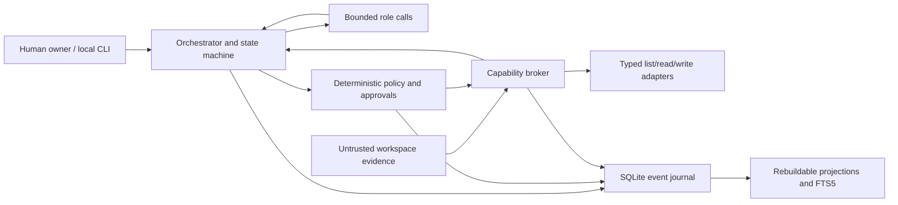

# Geth MVP architecture

Status: implemented MVP architecture. Deferred boundaries and residual risks are called out explicitly in `README.md` and this document.

## Architectural rule

> Centralize identity, policy, permissions, final accountability, and audit; decentralize analysis and bounded execution.

Geth uses a small trusted reference monitor around untrusted role/provider output. Models may propose typed work but cannot change state, approve, mint capabilities, invoke adapters directly, or suppress audit.



The trusted computing base is the CLI identity binding, orchestrator, transition functions, policy engine, approval service, capability broker, path containment, redactor, canonical serializer, and event writer. Providers, roles, files, message payloads, and tool outputs are untrusted data.

## Planned package boundaries

```text
src/geth_ai/
  cli.py, bootstrap.py, config.py
  domain/          enums, IDs, frozen models, messages, transitions
  application/     orchestrator, consensus, approvals, recovery, memory, health
  policy/          engine, actions/digests, delegations, redaction
  providers/       protocol, deterministic fake, prompt versions
  tools/           protocol, registry/broker, safe paths, filesystem adapters
  persistence/     migrations, event store, canonical JSON, projections, integrity
  observability/   structured logging and audit presentation
```

Dependency direction points inward: CLI/adapters depend on application services; application services depend on domain protocols; domain code depends on neither SQLite, Typer, nor provider implementations. The provider and tool protocols are deliberately small; no agent framework is required.

## Domain model

All boundary models use frozen Pydantic objects with `extra="forbid"`, schema versions, typed UUID identifiers, UTC timestamps supplied by an injected clock, and canonical integer/string representations instead of ambiguous floats.

| Entity/value | Essential fields and invariant |
|---|---|
| `Principal` | Owner or optional partner; authority comes only from a valid parent delegation. |
| `Delegation` | Parent grant, capability subset, root subset, budget subset, expiry no later than parent. |
| `Run` | Objective, owner, state, version, budget, lease, cancellation, terminal reason. |
| `WorkItem` | Bounded objective, acceptance criteria, role, dependencies, lease, state. |
| `MessageEnvelope` | ID, run, sender/recipient, correlation/causation, schema/payload type, payload hash. |
| `Proposal` | Objective, assumptions, steps, evidence needs, requested capabilities, risks, budgets, verification. |
| `EvidenceRef` | Claim, source kind/locator, content hash, observed time, uncertainty, sensitivity. |
| `Critique` | Challenged item, severity, evidence/safety/policy concern, missing test, revision. |
| `Synthesis` | Outcome, recommendation, confidence in basis points, accepted and unresolved dissent. |
| `ActionSpec` | Versioned tool, canonical arguments, requester, run/work item, risk, root/target, policy version, precondition, budget. |
| `ApprovalRequest` | Exact action digest, owner approver, expiry, nonce, status. |
| `CapabilityGrant` | One-use authority derived from approval; never generated by a role. |
| `ToolCall` | Action, policy result, grant claim, state, attempt, timing, result/postcondition. |
| `Artifact` | Type, safe locator, digest, size, producing call, verification status. |
| `AuditEvent` | Global/run sequence, actor, event type/version, redacted canonical payload, hash links. |
| `MemoryCandidate/Item` | Allowed category, content/sensitivity, provenance, status/supersession; content is outside audit. |
| `Budget` | Parent-bounded counters for calls, tokens, bytes, retries, rounds, concurrency, time, tools. |

Typed roles are `STEWARD`, `STRATEGIST`, `SKEPTIC`, `SYNTHESIZER`, `LOCAL_COMMANDER`, `EXECUTOR`, and `VERIFIER`. An immutable message is evidence of what a role said, never authority.

## Run and sub-state machines

Legal run transitions are:

```text
RECEIVED          -> TRIAGED | FAILED | CANCELLED
TRIAGED           -> PLANNING | BLOCKED | FAILED | CANCELLED
PLANNING          -> AWAITING_APPROVAL | VERIFYING | BLOCKED | FAILED | CANCELLED
AWAITING_APPROVAL -> EXECUTING | BLOCKED | CANCELLED
EXECUTING         -> VERIFYING | BLOCKED | FAILED | CANCELLED
VERIFYING         -> COMPLETED | BLOCKED | FAILED | CANCELLED
COMPLETED | FAILED | BLOCKED | CANCELLED -> no transitions
```

`PLANNING → VERIFYING` is reserved for an advisory/read-only result with no material action. Approval denial/expiry becomes `BLOCKED` with a durable reason. Cancellation is legal from every nonterminal state and wins races through optimistic version checks and boundary rechecks.

Additional machines:

- Approval: `PENDING → APPROVED → CLAIMED → CONSUMED`; alternate terminal `DENIED`, `EXPIRED`, `CANCELLED`.
- Tool call: `PROPOSED → POLICY_EVALUATED → AWAITING_APPROVAL/AUTHORIZED → RUNNING → SUCCEEDED/FAILED/TIMED_OUT/UNCERTAIN/DENIED`.
- Consensus: `COLLECTING → CRITIQUING → POLICY_CHECK → SYNTHESIZING → PASS/REVISE/ESCALATE_TO_OWNER`.
- Memory: `CANDIDATE → ACCEPTED/REJECTED → SUPERSEDED/FORGOTTEN`.

Transition tables are pure functions. The event writer applies accepted transitions and version-checked projections in one SQLite transaction. Illegal transitions are rejected before mutation. Forged approval decisions and denied broker invocations with a run context produce separate denial events.

## Orchestration flow

1. The CLI supplies the owner objective and selected workspace. The orchestrator persists `RunReceived`, creates parent budgets, and treats objective text as untrusted.
2. Steward triages ambiguity, welfare/safety, risk, and evidence needs.
3. Steward and Strategist receive the same canonical context independently; neither sees the other’s proposal.
4. Skeptic receives the persisted proposals and independently critiques assumptions, provenance, safety, policy, and missing tests.
5. The policy engine evaluates requested action classes. A veto cannot be outweighed.
6. Synthesizer emits `PASS`, `REVISE`, or `ESCALATE_TO_OWNER`, integer confidence, rationale, and immutable retained dissent. At most one revision occurs.
7. On `PASS`, Local Commander creates a bounded work item and acceptance criteria. Executor emits a typed action proposal but has no tool or approval authority.
8. The broker validates/dry-runs the action. A material write becomes an exact approval request and the run durably pauses.
9. A separate owner command displays and approves or denies that normalized action. Approval alone does not execute; it mints a one-use grant.
10. The broker atomically claims the grant, rechecks stop state, lease, policy, digest, budget, path, and precondition, records intent, then invokes the adapter.
11. Trusted orchestration independently reads the approved postcondition and checks its exact path, digest, byte length, and content before the separate Verifier role assesses that evidence. The no-overwrite adapter and end-to-end tree assertions prove the write creates only the approved file. Only verified evidence permits `COMPLETED`.
12. CLI returns concise outcome, confidence, dissent, verification/status, run ID, and audit instructions.

## Consensus protocol

Provider requests and responses are typed. Each request includes role, stage, objective/evidence context, prompt/provider version, and remaining budget, but no raw secret or capability grant. Responses may request capabilities as proposals only.

`PASS` means adequate advisory reasoning and no deterministic veto; it is not permission. `REVISE` is allowed only for a remediable evidence/test gap within remaining budgets. `ESCALATE_TO_OWNER` is required for material unresolved disagreement, insufficient authority/evidence, vetoes, or exhausted rounds. The synthesizer may summarize dissent but cannot edit or delete the source critiques.

The fake provider is deterministic by scenario, role, round, and typed input. It records a call ledger and can simulate malformed output, delays, retries, and failures. A response validation failure receives at most one classified retry; policy and authorization failures are never retried as transient.

## Policy and exact approval

The policy engine classifies every action and fails closed. Only bounded workspace list/read and approval-gated sandbox `write_text` are supportable tool actions. All other tool classes are denied before adapter lookup. The explicit owner `memory forget` command is an internal application data-lifecycle operation and does not expose a filesystem deletion capability.

The approval digest covers schema normalization version, tool/schema version, policy version, risk, run, work item, requester, owner, canonical root and resolved target, normalized arguments, exact content digest/length, overwrite mode, expected prior state, budgets, creation time, expiry, and random nonce. A changed value requires a new request.

Claim uses an atomic SQLite compare-and-swap so exactly one consumer moves `APPROVED → CLAIMED`. The grant is consumed only for its action and cannot be generalized. Consensus, provider text, evidence, approval IDs found in files, or agent messages cannot call the owner approval service.

## Tool and filesystem boundary

Each tool declares strict input/output schemas, risk, permitted roots, byte/call/time cost, timeout, idempotency, reversibility, and pre/postconditions. The broker is the only invocation path.

`fs.list` and `fs.read` accept normalized relative paths under the owner-selected read root, deny sensitive/hidden credential locations, limit bytes, and allow regular files only. `sandbox.write_text` accepts one relative target and exact bytes under the dedicated write root, requires the target to be absent, and never overwrites.

Containment must not use string-prefix checks or a resolve-then-open sequence. The portable implementation opens the root directory descriptor, walks each component relative to it with no-follow semantics, rejects symlinks and non-regular entries, and rechecks the parent identity immediately before installation. A same-directory temporary regular file is flushed/fsynced and installed atomically with no-overwrite semantics where supported. Platform limitations and residual races remain documented and tested.

## Persistence and audit

SQLite is stored outside the repository and migrated explicitly. The canonical `events` table has a global monotonically increasing sequence plus per-run order, event schema/type, UTC time, actor, redacted canonical JSON payload, previous event hash, payload hash, and event hash. Normal repositories cannot update/delete events. Current tables for runs, work, messages, approvals/grants, calls, artifacts, budgets, memory metadata, and provider use are projections that reducers can rebuild.

Redaction occurs recursively before serialization and hashing. Audit stores hashes, sizes, safe locators, IDs, and redacted summaries—not raw write content, secret-bearing prompts, environments, or exception representations.

The unkeyed chain detects ordinary mutation, insertion, deletion, gaps, and reordering relative to the available head. It cannot prevent or reliably detect full valid-chain replacement/recomputation by an attacker controlling the DB/code, or tail truncation without an independently retained head/count. `audit verify` must say so.

Memory content is deliberately separate from canonical events. Events retain only provenance/content hashes and a content-free forget tombstone, allowing owner deletion from ordinary rows and FTS5 without rewriting history.

## Side-effect transaction and recovery

SQLite and the filesystem cannot share an atomic transaction:

1. In one DB transaction, validate and claim the exact grant, append `ToolIntentRecorded`, and project `RUNNING`.
2. Recheck cancellation/emergency stop and filesystem preconditions immediately before the atomic install.
3. Perform the one no-overwrite filesystem commit.
4. In a second DB transaction, append result/artifact metadata, consume the grant, and advance projection.

After restart, migrations and audit verification run before work. Expired leases prevent stale workers from acting; pending approvals remain inspectable but are conservatively expired at their deadline. A `RUNNING` call without a durable result becomes `UNCERTAIN`. Recovery compares the exact approved path, content, length, and digest: a matching postcondition records reconciled success and leaves the run in `VERIFYING`; absence, mismatch, unavailable exact arguments, cancellation, or emergency stop blocks for owner review. Recovery never retries a filesystem effect. Journal-only projection rebuild deliberately cannot recreate executable approval arguments, so such approvals fail closed and require a fresh request.

Cancellation is durably appended, pending grants are revoked, and checks occur before provider calls, transitions, retries, grant issuance/claim, and tool commit. The global emergency-stop latch lives in application data, works without a provider, persists across restart, and requires explicit owner reset; unreadable or inconsistent latch state fails closed.

## CLI and health

Typer provides the commands listed in `README.md`. `run` and `demo` stop at approval. `approve` redisplays exact normalized action metadata and resumes only that run; `deny` produces no tool call. `--verbose` exposes redacted structured detail; default output is concise. The MVP has no interactive auto-approval path.

`doctor` checks paths/permissions, SQLite migration and FTS5 support, sandbox containment prerequisites, emergency stop, audit integrity, provider selection, and budget defaults without provider/network calls.

## Verification strategy

- Pure units: transitions, canonicalization/digests, policy, budgets, consensus, redaction, hashes.
- Components with temporary SQLite/filesystems: approval atomics, broker containment, events/projections, FTS5, recovery.
- Deterministic orchestration: approve, deny, cancel/restart, PASS/REVISE/ESCALATE, failures and limits.
- CLI subprocesses: every command, exit code, concise output, no-network/no-daemon behavior.

Tests inject frozen UTC/monotonic clocks, deterministic IDs, scripted provider ledgers, fault checkpoints, temp roots, secret canaries, and a socket guard. A traceability meta-test prevents acceptance criteria from becoming orphaned.
